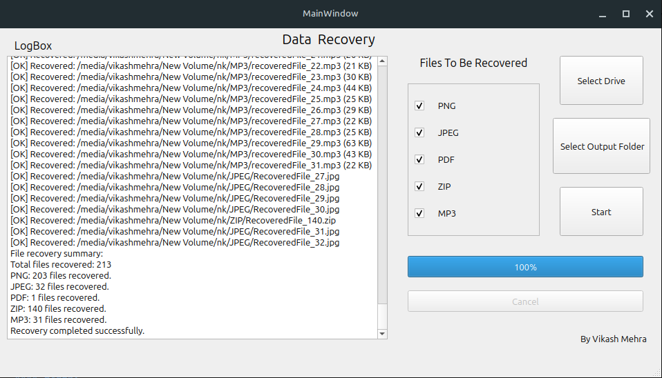

# 🔍 Data Recovery Tool

A high-performance C++/Qt-based tool for recovering deleted files from raw disk images or devices.  
Supports multiple file types with signature-based detection and clean GUI integration.

---

## ✨ Features

- 🚀 Fast recovery of common file types:
  - PNG, JPEG, MP3, PDF, ZIP
- 📦 Signature-based file detection
- 🪟 Modern Qt GUI
- 📜 Logging with real-time feedback
- ❌ Cancellation support for long operations
- 🧱 Modular architecture with recovery engine separated from GUI
- 🧪 Easy to test and extend

---

## 🖥️ Screenshots




---

## 🔧 How to Run

### 🐧 Linux (Tested on Linux Mint)

This project comes **prebuilt**, so you don't need to compile it yourself.

#### Steps:

1. Open a terminal.
2. Navigate to the prebuilt binary location:

```bash
cd QT-GUI/build/desktop-debug/
````

3. Run the application:

```bash
sudo ./QT-GUI
```

> ⚠️ `sudo` is required only if you're accessing raw disks or protected device files.

---

## 📁 Folder Structure

```
.
├── QT-GUI/
│   ├── build/desktop-debug/    # Prebuilt binary lives here
│   ├── mainwindow.ui
│  
├── RecoveredData/              # Output folder (ignored in Git)
├── main.cpp
├── recoveryengine.h / .cpp
├── mp3.h / mp3.cpp
├── README.md
└── CMakeLists.txt / .pro       # Optional build system files
```

---

## 🔐 File Types & Signatures

| Format | Signature (Hex)           | Notes               |
| ------ | ------------------------- | ------------------- |
| PNG    | `89 50 4E 47 0D 0A 1A 0A` | Standard PNG header |
| JPEG   | `FF D8 ... FF D9`         | JFIF/Exif support   |
| MP3    | `FF FB` / `ID3` tag       | Frame-aware parsing |
| PDF    | `%PDF-`                   | Recover till EOF    |
| ZIP    | `50 4B 03 04`             | Standard archive    |

---


## 🧩 Future Plans

* [ ] Add support for MP4, DOCX, and SQLite
* [ ] Hex view in GUI for forensic inspection
* [ ] File preview before saving
* [ ] Multi-threaded recovery engine

---

## 🙌 Contributing

Pull requests, bug reports, and suggestions are welcome.
Feel free to fork and improve the tool!

---

## 🧙 Author

**Vikash Mehra**
C++ Developer | B.Tech CSE @ IIT Ropar
[GitHub](https://github.com/VikashMehra01)

---

## 📜 License

MIT License – free to use, modify, and distribute.

---

